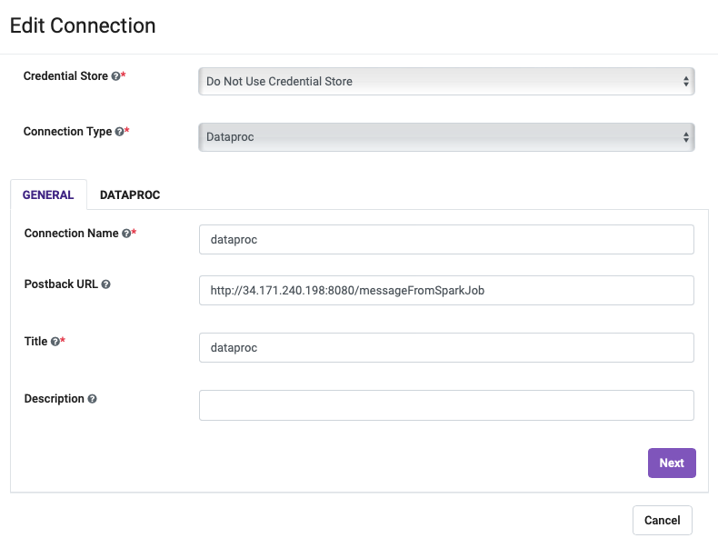

# Google Cloud Launcher

## Launching and deployment of Sparkflows Instance
First off we're going to deploy an instance.  That's really easy with Cloud Launcher.  Simply go to https://console.cloud.google.com/marketplace/product/sparkflows-public/fire-insights?project=sparkflows-public


Click "Launch"


You can take the default settings or customize them.  When complete click "Deploy"

Common Configuration Steps:
- Provide Deployment name
- Select the Zone
- Select a machine type that has at least 4 vCPU and 8GB RAM
- On Boot disk section, click on change and then select the Custom Images tab.
- Allow TCP port 8080 traffic from the Internet.


When complete you should see:


**Note**
- The product is entirely deployed in a single VM within the customer's GCP project. The customer does have an option to use an external relational database like MySQL or Postgres, but by default it uses H2 (file based) database.
- Customer Project needs to have access to different services like GCS, BigQuery Dataproc Cluster.


Once you have the instance up and running, you need to grab the external IP( lets say 192.xx.xx.xxx) and visit http://192.xx.xx.xxx:8080 to view the login screen.

## Generate and Configure Google service account JSON Key

In order to authenticate to the GCP services like GCS and BigQuery, you need to [generate](https://cloud.google.com/iam/docs/keys-create-delete#creating) and save the access key to the above VM created in the directory - `/home/sparkflows` with name as `sparkflows-key.json`. In order to switch to the `sparkflows` user in the VM, use the password `Sparklows`

Now edit the file `/home/sparkflows/fire.sh` and uncomment the line #5, where the variable `GOOGLE_APPLICATION_CREDENTIALS` has been exported. Save the file and restart the service using the below command: 

```
sudo systemctl restart fire.service
``` 

Now wait for 30 seconds, and visit the http://192.xx.xx.xxx:8080 url to access the login screen, with GCP support enabled.

## Create Dataproc Cluster with proper spark library dependency 

Specify the following properties:
- dataproc-initialization-script: gs://goog-dataproc-initialization-actions-us-west1/connectors/connectors.sh
- spark-bigquery-connector-url: gs://sparkflows-libs/bigquery/spark-bigquery-with-dependencies_2.12-0.30.0.jar

**Reference:**
https://cloud.google.com/dataproc/docs/concepts/configuring-clusters/init-actions#console
https://github.com/GoogleCloudDataproc/initialization-actions/tree/master/connectors

## Ensure proper roles assigned to the Dataproc Cluster to access BigQuery and GCS
- Refer to https://cloud.google.com/dataproc/docs/concepts/iam/iam
  
## Configure Callback URL in Sparkflows


## Configure Dataproc Connection in Sparkflows

- Enable GCP


- Enable Dataproc



## Run a sample workflow to test the End-2-End Connctivity with GCS and Dataproc 
- Open the sample project
  
- Run the sample workflow
  

## Additional Notes
- Step to login to vm
```
gcloud compute ssh --zone "<zone-name>" "<instance-name>"  --project "<project-name>"
```
- Step to restart Spark server
```
sudo systemctl restart fire.service
```
